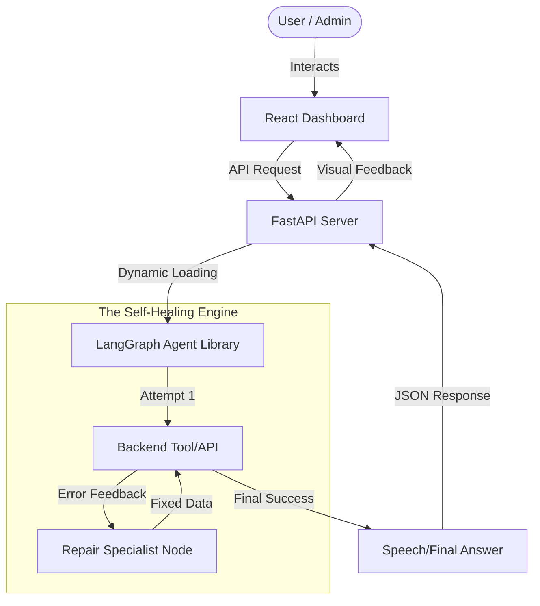

# 🏛️ Technical Architecture: Autonomous Resilience Lab

This document explains the "Self-Healing" logic and the technical stack that powers the **Resilience AI Lab.**

---

## 1. High-Level System Flow
The application follows a **Modular Full-Stack** architecture:

---

## 2. The "Healing Loop" Logic
Unlike standard agents, our engine uses **Cyclic Directed Acyclic Graphs (DAGs)**.

### Pattern: Action -> Feedback -> Correction
1.  **Structured State**: We use a `TypedDict` to track the "Baton" of information throughout the graph. 
2.  **The Diagnostic Router**: Before fixing anything, the AI diagnoses the *cause* of failure (e.g., "Is this a missing field or a bad instruction?").
3.  **The Specialist Node**: We have specialized brains for **Payload Repair**, **Prompt Engineering**, and **Workflow Re-sequencing**. This modular approach is more reliable than one large prompt.

---

## 3. Data Flow (State Management)
The `State` object is persistent across loops. This allows the "Repair Specialist" to see exactly why the tool failed and use that context to generate a perfect fix.

---

## 4. Technology Selection
- **LangGraph**: For managing complex, cyclic agentic state.
- **Pydantic**: For 100% type-safe data handling (prevents "hallucinations" in the JSON).
- **FastAPI**: For high-performance async communication with the frontend.
- **Vite/React**: For a modern, reactive user interface with real-time logs.
