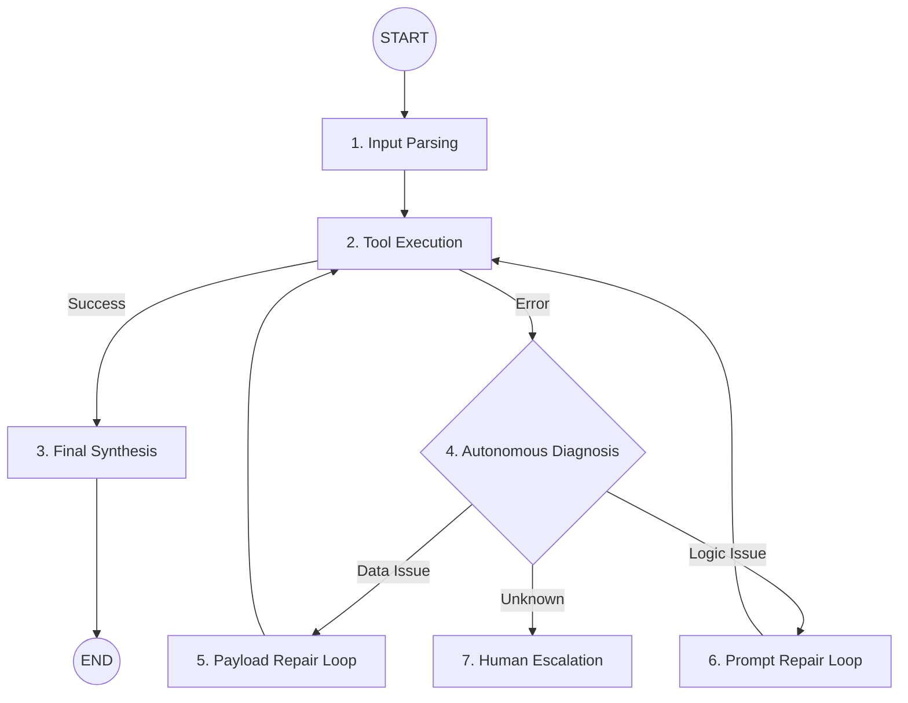

# 🛡️ Autonomous Resilience AI Lab: High-Level Mechanism

The Resilience Lab is designed to showcase the transition from **Fragile AI** (single-shot execution) to **Resilient AI** (cyclic self-healing loops).

## 🌋 The Core Problem: The "Fragility Gap"
Traditional AI agents follow a linear path: `Input -> Process -> Output`. If `Process` fails (due to API error, malformed data, or logic bug), the agent crashes.

## 🏗️ The Resilient Mechanism: Cyclic Healing Loops
Our architecture utilizes **LangGraph** to implement a "Retry-with-Diagnosis" pattern.

### 🗝️ Key Patterns Implemented:
1.  **Mission 02-04: Payload Repair**: When an API returns a "Missing Field" error, the agent doesn't crash. It routes to a "Repair Node" that uses an LLM to hallucinate/correct the missing data based on context, then retries the API.
2.  **Mission 06-07: Prompt/Workflow Repair**: If the logic fails, the agent autonomously rewrites its own instructions or re-orders its processing steps to bypass the bottleneck.
3.  **Mission 12 (The Capstone)**: Integrates all patterns into a unified IT Helpdesk agent that can handle complex multi-step failures without user intervention.

## 🚀 The Dashboard (Mission Control)
The dashboard provides a real-time trace of the **Agent's Internal Thoughts**. You can see the exact moment an error is caught and the subsequent `[HEALING]` action taken by the graph.
